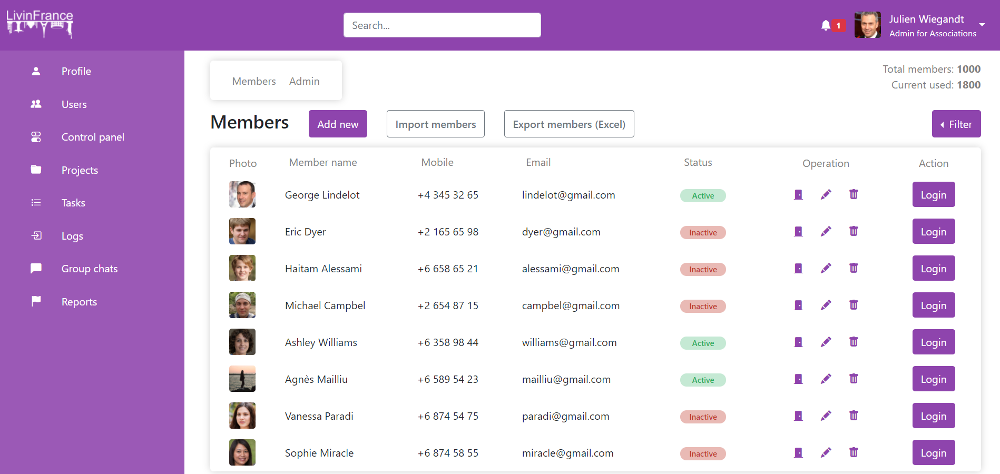

# LivinFranceTest

This project was generated with [Angular CLI](https://github.com/angular/angular-cli) version 11.2.10.

## Development server

Run `ng serve` or `npm start` for a dev server. Navigate to `http://localhost:4200/`. The app will automatically reload if you change any of the source files.

## Consignes du Test

- Le projet peut être soit en angular soit en html/css simple (préférence pour le angular)
- Ne pas utiliser de plugins pour le tableau (autre que angular, js ou bootstrap) il faut le faire maison.
- Vous avez jusqu'à lundi matin pour le faire. Sachant qu'il n'y a pas forcément le temps de tout faire, nous n'attendons pas à ce que tout soit fait. **A toi de faire ce qui te semble nécessaire.**

### La maquette

### Objectifs principaux

Avoir une appli comportant, comme sur la maquette :

Un header dans lequel il y a :

- Un logo (on peut juste écrire logo)
- Un champ recherche (il n'a pas besoin de fonctionner)
- Un cloche notifications (juste une icon, pas besoin d'action dessus ni que cela fonctionne)
- Un résumé du user loggé (en dur, pas besoin que cela fonctionne)
- Si manque de temps, tu peux remplacer tout le header par une simple bande de couleur.
- Un menu à gauche, avec juste des noms de rubriques, pas besoin qu'il fonctionne. (par contre attention aux hover)
- Un tableau d'utilisateurs, comportant :
  - Une colonne avatar, une colonne nom-prenom, une colonne téléphone, une colonne adresse email, un statut, des boutons d'actions (pas besoin qu'ils fonctionnent), une colonne avec un gros bouton 'login' (pas besoin qu'il fonctionne).
  - Les colonnes doivent être triables en cliquant sur le nom de la colonne.
  - Les gros boutons add, new, import, filter et export n'ont pas besoin de fonctionner.
  - On peut ajouter un bouton quelque part permettant de n'afficher que les user en statut actif ou inactifs.

## Le travail rendu

Bonjour, c'est Julien Wiegandt ! J'ai effectué ce travail donné le 24/04/2021 après midi pour le 27/04/2021 matin dans le cadre du test technique pour obtenir mon stage de 4e année d'étude d'ingénieur à LivinFrance.

### J'ai répondu aux besoins ?

Je pense avoir répondu en grande partie aux besoins spécifiés dans la consigne. Répondre à une consigne et répondre à absolument tous les besoins d'un client n'est pas possible sans un cahier des charges clair et complet ainsi que plusieurs réunions avec celui-ci. ici, j'ai préféré être autonome en prenant le risque de ne pas répondre complètement à la consigne.

### Mon rendu

### Les fonctionnalités

- Le logo est un lien
- Les deux boutons dropdown (ici "Julien Wiegandt" et "Filter") affichent des liens
- Members et Admin sont des liens avec :hover
- La sidebar (menu de gauche) a des liens avec :hover
- Les colonnes suivantes du tableau sont clickables pour un tri des valeurs:
  - Member name
  - Mobile
  - Email
  - Status

### Le responsive

- Le header est responsive (il devient un menu mobile)
- La sidebar est responsive (elle n'affiche que les icons)
- Le tableau n'est pas vraiment adapté pour mobile

### Les technos / Le code

J'ai utilisé Angular / html / css / Boostrap5.

Il a trois composents Angular dans l'application

- La navbar (le header)
- La sidebar (le menu de gauche)
- Users (le tableau des users et les boutons/filtres qui vont avec)

Boostrap5 est utilisé de temps en temps pour m'éviter de faire des fonctionnalités ou du css qu'ils font déjà bien.

Autres choses à savoir :

- Les couleurs principalement utilisés sont paramétrables dans un unique ficher src/app/theme.variables.css
- J'ai utilisé la convention BEM pour le nommage des classes css
